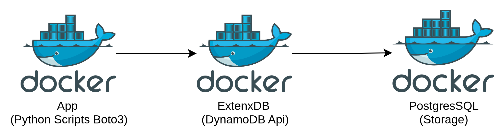
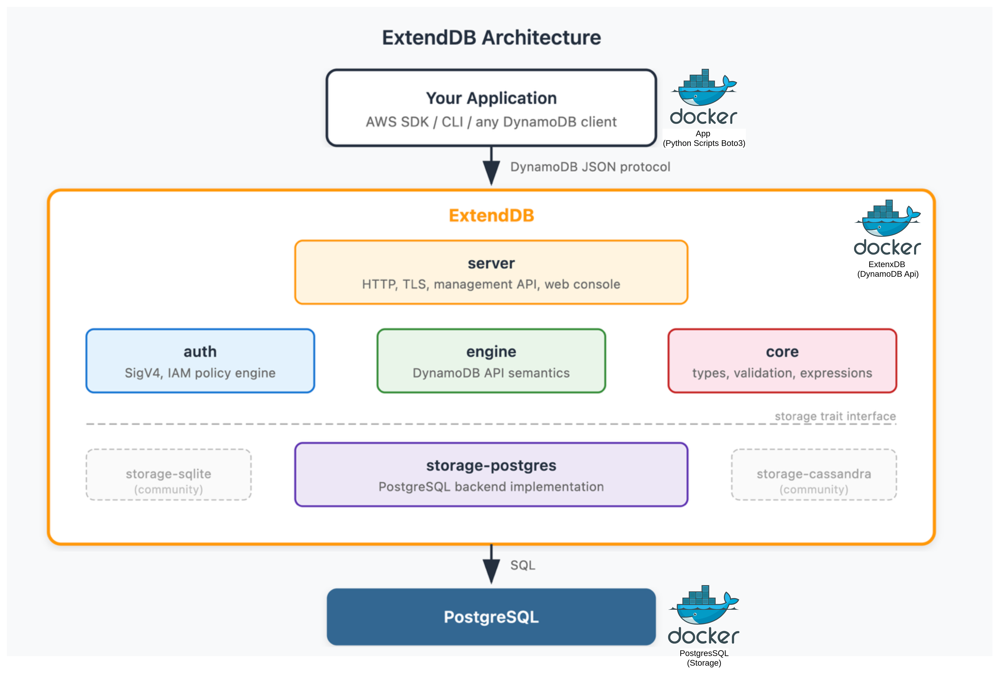
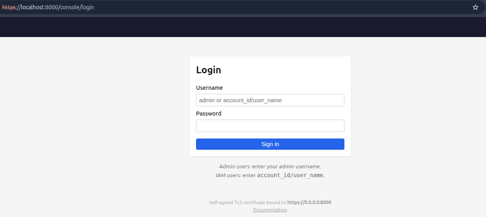
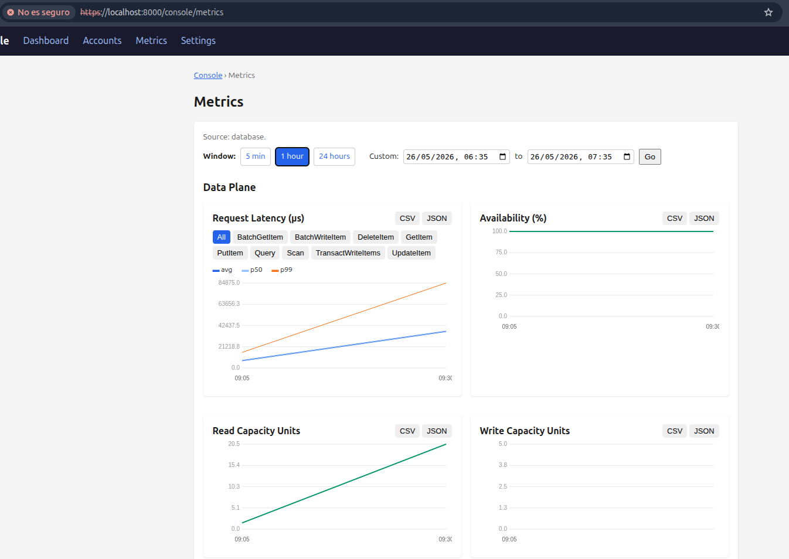
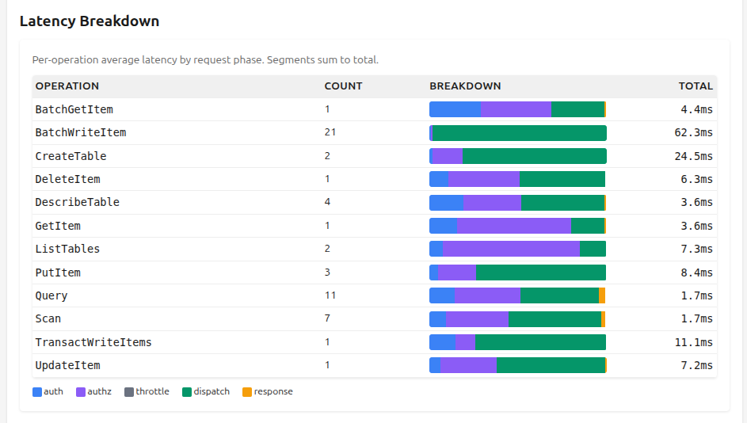
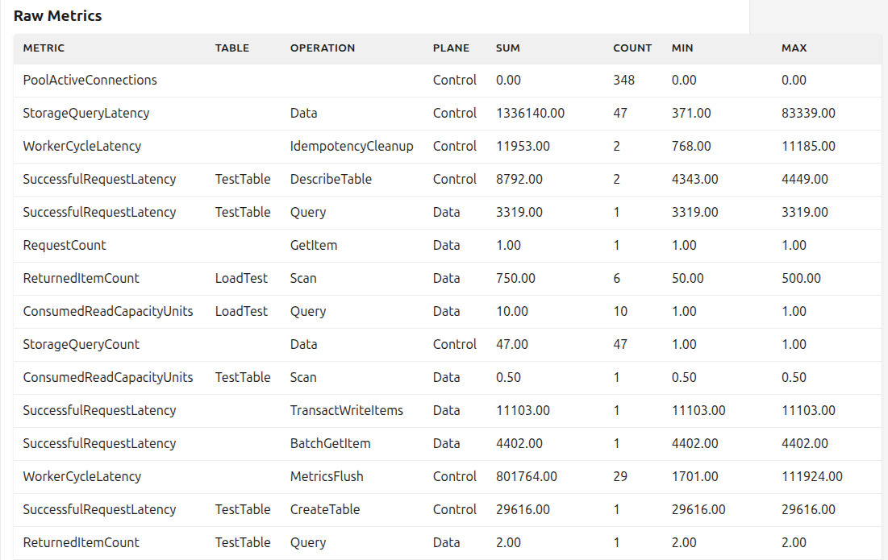

# DynamoDB - ExtendDB Local

Run a full DynamoDB-compatible environment locally with Docker using [ExtendDB](https://github.com/ExtendDB/extenddb) — no AWS account required.

## Architecture



<!-- ```
┌──────────────┐     ┌──────────────┐     ┌──────────────┐
│   postgres   │◄────│   extenddb   │◄────│     app      │
│  (storage)   │     │  (DynamoDB   │     │  (Python     │
│              │     │   API)       │     │   scripts)   │
└──────────────┘     └──────────────┘     └──────────────┘
``` -->

Three containers:
- **postgres** — PostgreSQL 15 as the storage backend
- **extenddb** — Built from [source](https://github.com/ExtendDB/extenddb) (multi-stage Rust build), exposes DynamoDB API on port 8000 with TLS
- **app** — Python container with multiple scripts selectable at runtime
- **/dynamo-admin** — GUI for DynamoDB Local, dynalite, localstack etc.


### Based on the original ExtendDB architecture:



## Quick Start

```bash
# First time (builds images, ~6 min for Rust compilation)
docker compose up --build

# Subsequent runs (uses cached images)
docker compose up

# Fresh start (wipes databases and credentials)
docker compose down -v && docker compose up
```

On startup, the `app` container runs the **smoke test** (default) to validate connectivity.
The `extenddb` container is idempotent — if already initialized, it just starts the server.

## Available Scripts

| Script | Description |
|--------|-------------|
| `smoke_test` | Quick validation: create table, put/get/delete item (default) |
| `crud_test` | Full CRUD test: all DynamoDB operations, keeps data for inspection |
| `load_test` | Writes N items in batches + queries/scans for metrics generation |
| `cleanup` | Deletes all test tables |

## Running Scripts (Docker)

```bash
# Start all containers (app stays alive waiting for commands)
docker compose up -d

# Execute scripts against the running app container
docker compose exec app python scripts/smoke_test.py
docker compose exec app python scripts/crud_test.py
docker compose exec app python scripts/load_test.py 500
docker compose exec app python scripts/cleanup.py

```

## Running Scripts (Local — no rebuild needed)

```bash
# Create virtualenv (one time)
python3 -m venv .venv
source .venv/bin/activate
pip install -r app/requirements.txt

# Load credentials from the running container
eval $(docker compose exec extenddb cat /shared/credentials.env)
echo $AWS_ACCESS_KEY_ID
echo $AWS_SECRET_ACCESS_KEY

# Set the ExtendDB endpoint
export ENDPOINT_URL=https://localhost:8000

# Run any script directly
python app/scripts/smoke_test.py
python app/scripts/crud_test.py
python app/scripts/load_test.py 200
python app/scripts/cleanup.py
```

Requirements for local execution:
```bash
pip install boto3
```

## Connect with AWS CLI

```bash
# Load credentials
eval $(docker compose exec extenddb cat /shared/credentials.env)

# Use any DynamoDB CLI command
aws dynamodb list-tables \
  --endpoint-url https://localhost:8000 \
  --region us-east-1 \
  --no-verify-ssl

aws dynamodb scan \
  --table-name TestTable \
  --endpoint-url https://localhost:8000 \
  --region us-east-1 \
  --no-verify-ssl
```

## Management Console

ExtendDB web console at: `https://localhost:8000/console/`

Login:
- **Username:** admin
- **Password:** admin123secret

View metrics, accounts, users, and access keys. Accept the self-signed certificate warning.

## Data Explorer (dynamodb-admin)

GUI for browsing tables and items at: `http://localhost:8001`

No login required — uses the same credentials as the app container. Create, edit, delete items and run queries visually.

## How Credentials Work

1. `extenddb init` creates an admin user (username/password from env vars)
2. The entrypoint creates an IAM user + DynamoDB full-access policy via `extenddb manage`
3. An access key is generated and written to `/shared/credentials.env` (shared Docker volume)
4. The app container waits for the file, sources it, and runs the selected script

## Project Structure

```
extenddb-local/
├── docker-compose.yml          # 3 services: postgres, extenddb, app
├── Dockerfile.extenddb         # Multi-stage: Rust build from GitHub + slim runtime
├── entrypoint.sh               # Init, serve, create IAM user + access key
├── app/
│   ├── Dockerfile              # Python 3.12 slim
│   ├── entrypoint.sh           # Wait for credentials + run selected script
│   ├── requirements.txt        # boto3
│   └── scripts/
│       ├── common.py           # Shared boto3 connection (Docker + local)
│       ├── smoke_test.py       # Quick validation (default)
│       ├── crud_test.py        # Full CRUD operations test
│       ├── load_test.py        # Batch load for metrics
│       └── cleanup.py          # Delete test tables
└── README.md
```

## Lifecycle Commands

```bash
# Start (idempotent, reuses existing data)
docker compose up

# Stop without losing data
docker compose down

# Full reset (wipes databases, credentials, volumes)
docker compose down -v && docker compose up

# Rebuild only the app (after editing scripts)
docker compose build app

# Rebuild everything from scratch
docker compose up --build
```

## Troubleshooting

- **"security token included in the request is invalid"** — credentials not loaded. Run `eval $(docker compose exec extenddb cat /shared/credentials.env)`
- **"AlreadyExists" on restart** — run `docker compose down -v` to clear volumes
- **Slow first build** — Rust compilation takes ~6 min. Docker caches the layer for subsequent runs
- **Scripts not found** — ensure you're in the `dynamodb/extenddb-local/` directory

## Example Stats (500 writes)

### The ExtendDB portal (login — https://localhost:8000):



### Docker resource consumption

```
~/workspace/aws-examples (main *)$ docker stats --no-stream 2>&1
CONTAINER ID   NAME                        CPU %     MEM USAGE / LIMIT     MEM %     NET I/O          BLOCK I/O         PIDS
2d506bbf6aaa   extenddb-local-app-1        0.01%     4.828MiB / 31.09GiB   0.02%     158kB / 154kB    12.4MB / 463kB    1
3c2942ed6759   extenddb-local-extenddb-1   0.00%     14.24MiB / 31.09GiB   0.04%     977kB / 1.11MB   8.24MB / 20.5kB   10
06ebf1031a3d   extenddb-local-postgres-1   4.15%     74.94MiB / 31.09GiB   0.24%     850kB / 796kB    1.71MB / 98MB     18
```
### The ExtendDB portal (metrics):







## Pending: Performance Benchmarks

With this structure I want to create scripts to measure ExtendDB performance characteristics:

| Script | Description |
|--------|-------------|
| `write_throughput` | Measures items/s with different item sizes (1KB, 10KB, 100KB). Compares PutItem vs BatchWriteItem. Reports p50, p95, p99 latency |
| `read_patterns` | Compares GetItem (point) vs Query (range) vs Scan (full). Varies response size (1, 10, 100, 1000 items) |
| `concurrent_load` | Simulates multiple concurrent clients (5, 10, 20, 50) with threads/asyncio. Measures latency degradation under load with configurable read/write mix (80/20, 50/50) |
| `transaction_bench` | Benchmarks TransactWriteItems with 2, 5, 10, 25 operations. Measures transactional overhead vs individual writes. Simulates conflicts with condition expressions |
| `item_size_bench` | Writes/reads items of 100B, 1KB, 10KB, 100KB, 400KB (DynamoDB max). Measures latency impact per size |