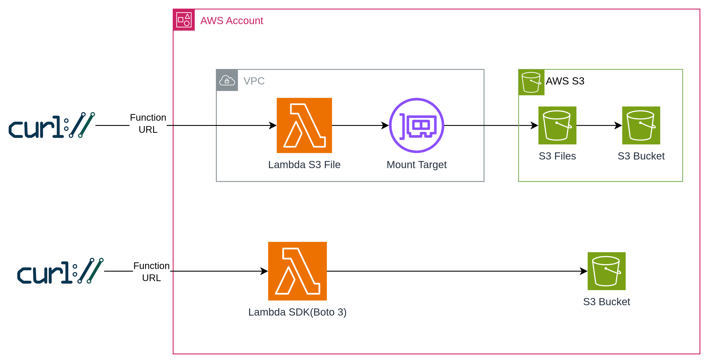

# 🗂️ S3 Files + Lambda

POC to test the integration and performance of [Amazon S3 Files](https://docs.aws.amazon.com/AmazonS3/latest/userguide/s3-files.html) with AWS Lambda, allowing S3 buckets to be mounted as local filesystems using standard file operations (read, write, list, delete) — no SDK required and compare with SDK way.

> **Amazon S3 Files** (launched April 2026) delivers a shared file system built on Amazon EFS that connects AWS compute resources directly with S3 data via NFS mount.

## Architecture





## Available Operations

Both Lambda functions expose the same 5 operations for direct comparison:

| Operation | S3 Files (filesystem) | SDK (boto3) |
|-----------|----------------------|-------------|
| `write` | `open(path, 'w').write(content)` | `s3.put_object(Bucket, Key, Body)` |
| `read` | `open(path, 'r').read()` | `s3.get_object(Bucket, Key)['Body'].read()` |
| `list` | `os.listdir(path)` | `s3.list_objects_v2(Bucket, Prefix)` |
| `delete` | `os.remove(path)` | `s3.delete_object(Bucket, Key)` |
| `all` | Runs write → list → read → delete sequentially |

## Benchmark Results

Performance comparison between S3 Files (filesystem mount) and traditional SDK (boto3) approach. Each operation was executed **100 times** and averaged.

### Summary

| Operation | S3 Files (ms) | SDK boto3 (ms) | Speedup |
|-----------|---------------|----------------|----------|
| **write** | 13.15 | 30.2 | **2.3x** |
| **list** | 3.74 | 21.95 | **5.9x** |
| **read** | 3.4 | 29.51 | **8.7x** |
| **delete** | 5.04 | 25.04 | **5.0x** |

### Detailed Statistics

#### S3 Files (filesystem)

| Operation | Avg (ms) | Min (ms) | Max (ms) | Median (ms) | P95 (ms) |
|-----------|----------|----------|----------|-------------|----------|
| write | 13.15 | 10.89 | 121.37 | 11.79 | 14.1 |
| list | 3.74 | 3.32 | 10.09 | 3.58 | 4.29 |
| read | 3.4 | 3.17 | 3.97 | 3.38 | 3.77 |
| delete | 5.04 | 4.45 | 6.34 | 5.01 | 5.69 |

#### SDK (boto3)

| Operation | Avg (ms) | Min (ms) | Max (ms) | Median (ms) | P95 (ms) |
|-----------|----------|----------|----------|-------------|----------|
| write | 30.2 | 20.61 | 90.72 | 26.71 | 66.35 |
| list | 21.95 | 16.33 | 31.43 | 22.12 | 27.19 |
| read | 29.51 | 23.58 | 86.84 | 28.27 | 32.68 |
| delete | 25.04 | 16.15 | 87.72 | 22.29 | 40.23 |

### How time is measured

Each operation is timed internally inside the Lambda using `time.time()` before and after the core I/O operation. This measures only the actual I/O time, excluding Lambda cold start, network latency from the caller, and Function URL overhead.

**S3 Files (filesystem):**
```python
start = time.time()
with open('/mnt/s3files/test.txt', 'w') as f:
    f.write(content)
elapsed_ms = (time.time() - start) * 1000
```

**SDK (boto3):**
```python
start = time.time()
s3.put_object(Bucket=bucket, Key=key, Body=content.encode())
elapsed_ms = (time.time() - start) * 1000
```

The same pattern applies to all operations (read, list, delete). Only the target operation is measured — no setup, serialization, or response formatting is included in the elapsed time.

### Raw Data:

- Both Lambdas used **512 MB memory** and **Python 3.9** runtime in **us-east-1**

> Full raw data with all 100 individual measurements available in [docs/benchmark_calculations.md](docs/benchmark_calculations.md)

### CloudWatch Metrics

Lambda execution metrics collected from CloudWatch Logs Insights across all invocations:

| Metric | S3 Files (mount) | SDK (boto3) |
|--------|-----------------|-------------|
| **Invocations** | 207 | 200 |
| **Avg Duration** | 27.23 ms | 113.88 ms |
| **Min Duration** | 1.91 ms | 86.76 ms |
| **Max Duration** | 138.66 ms | 320.00 ms |
| **Avg Memory Used** | 54.84 MB | 82.97 MB |
| **Max Memory Used** | 56.27 MB | 82.97 MB |
| **Avg Billed Duration** | 28.86 ms | 114.36 ms |
| **Cold Starts** | 2 | 0 |
| **Avg Cold Start** | 117.54 ms | N/A |

Key takeaways from CloudWatch:
- S3 Files Lambda uses **34% less memory** (55 MB vs 83 MB) since it doesn't load the boto3 S3 client
- End-to-end duration is **4.2x faster** with S3 Files (27ms vs 114ms)
- Billed duration is **4x lower** with S3 Files, directly reducing Lambda costs
- S3 Files Lambda had 2 cold starts (117ms avg) due to VPC + NFS mount initialization

## Deployment

### Prerequisites

- [Terraform](https://www.terraform.io/downloads) >= 1.5.0
- [AWS CLI](https://aws.amazon.com/cli/) configured
- S3 Files available in your region

### Steps

```bash
cd s3/s3-lambda

terraform init
terraform plan
terraform apply
```

### Outputs

```
bucket_name              = "s3-lambda-files-123456789012"
file_system_id           = "fs-0abc123def456"
access_point_arn         = "arn:aws:s3files:us-east-1:123456789012:access-point/fsap-0abc123"
lambda_function_name     = "s3-lambda-files-mount"
lambda_function_url      = "https://xxxxx.lambda-url.us-east-1.on.aws/"
lambda_sdk_function_name = "s3-lambda-files-sdk"
lambda_sdk_function_url  = "https://yyyyy.lambda-url.us-east-1.on.aws/"
vpc_id                   = "vpc-0abc123"
```

## Testing

### S3 Files Lambda (filesystem mount)

```bash
# Write a file
curl -s -X POST https://xxxxx.lambda-url.us-east-1.on.aws/ \
  -H 'Content-Type: application/json' \
  -d '{"operation": "write", "filename": "hello.txt", "content": "Hello from S3 Files!"}' | python3 -m json.tool

# Read a file
curl -s -X POST https://xxxxx.lambda-url.us-east-1.on.aws/ \
  -H 'Content-Type: application/json' \
  -d '{"operation": "read", "filename": "hello.txt"}' | python3 -m json.tool

# List files
curl -s -X POST https://xxxxx.lambda-url.us-east-1.on.aws/ \
  -H 'Content-Type: application/json' \
  -d '{"operation": "list"}' | python3 -m json.tool

# Run all operations
curl -s -X POST https://xxxxx.lambda-url.us-east-1.on.aws/ \
  -H 'Content-Type: application/json' \
  -d '{"operation": "all"}' | python3 -m json.tool
```

### SDK Lambda (boto3)

```bash
# Same operations, same payloads — just different URL
curl -s -X POST https://yyyyy.lambda-url.us-east-1.on.aws/ \
  -H 'Content-Type: application/json' \
  -d '{"operation": "all"}' | python3 -m json.tool
```

### Using AWS CLI

```bash
# S3 Files Lambda
aws lambda invoke --function-name s3-lambda-files-mount \
  --payload '{"operation": "all"}' \
  --cli-binary-format raw-in-base64-out \
  --region us-east-1 /dev/stdout

# SDK Lambda
aws lambda invoke --function-name s3-lambda-files-sdk \
  --payload '{"operation": "all"}' \
  --cli-binary-format raw-in-base64-out \
  --region us-east-1 /dev/stdout
```

## Important Notes

### S3 Files Requirements
- **VPC**: Lambda must run inside a VPC with mount targets
- **Subnets**: Mount targets required in each subnet where Lambda is deployed
- **Security Groups**: Must allow NFS traffic (port 2049) between Lambda and mount targets
- **Memory**: Minimum 512 MB for direct S3 reads optimization
- **Bucket Versioning**: Must be enabled on the S3 bucket

### Service Principal
S3 Files is built on Amazon EFS internally. The IAM trust policy for the S3 Files role uses `elasticfilesystem.amazonaws.com` as the service principal.

## Security

- **Isolated VPC**: S3 Files Lambda runs inside private subnets
- **Restrictive Security Group**: Only NFS (2049) within VPC and HTTPS (443) outbound
- **IAM Least Privilege**: Separate roles for S3 Files and Lambda with minimal permissions
- **Function URLs**: Configured as `NONE` auth for testing (change to `AWS_IAM` for production)

## Cleanup

Since the S3 bucket has versioning enabled, you must empty all object versions before destroying the infrastructure:

```bash
# 1. Empty the bucket (all versions and delete markers)
BUCKET="s3-lambda-files-$(aws sts get-caller-identity --query Account --output text)"

aws s3api list-object-versions --bucket $BUCKET --region us-east-1 --no-cli-pager --output json | \
python3 -c "
import sys, json
data = json.load(sys.stdin)
objects = []
for v in data.get('Versions', []):
    objects.append({'Key': v['Key'], 'VersionId': v['VersionId']})
for d in data.get('DeleteMarkers', []):
    objects.append({'Key': d['Key'], 'VersionId': d['VersionId']})
if objects:
    print(json.dumps({'Objects': objects, 'Quiet': True}))
else:
    print(json.dumps({'Objects': [], 'Quiet': True}))
" > /tmp/delete.json && \
aws s3api delete-objects --bucket $BUCKET --delete file:///tmp/delete.json --region us-east-1 --no-cli-pager

# 2. Destroy all resources
terraform destroy
```

## References

- [Amazon S3 Files Documentation](https://docs.aws.amazon.com/AmazonS3/latest/userguide/s3-files.html)
- [Configuring S3 Files with Lambda](https://docs.aws.amazon.com/lambda/latest/dg/configuration-filesystem-s3files.html)
- [Terraform aws_s3files_file_system](https://registry.terraform.io/providers/hashicorp/aws/latest/docs/resources/s3files_file_system)
- [Terraform aws_s3files_mount_target](https://registry.terraform.io/providers/hashicorp/aws/latest/docs/resources/s3files_mount_target)
- [Terraform aws_s3files_access_point](https://registry.terraform.io/providers/hashicorp/aws/latest/docs/resources/s3files_access_point)
